# Business Diagram Visual Language

Use this reference for every diagram produced by the skill.

## Contents

- Visual encoding principle
- Shape grammar
- Color identity rules
- Recommended palette
- Mermaid template
- Modeling rules
- Language checklist

## Visual encoding principle

Encode two independent dimensions:

- **Shape communicates semantic type:** action, decision, status, business object, note, or terminal.
- **Color communicates subject identity:** the exact actor performing an action or the exact business entity owning a status.

Never use a generic `userAction` or `status` class when more than one role or status-bearing entity appears. Create one class per subject, such as `buyerAction`, `sellerAction`, `orderStatus`, and `taskStatus`.

The same semantic type may use the same shape but must use a different color for each subject:

- Buyer action and Seller action: both rounded rectangles, different colors.
- Order status and Task status: both ellipses, different colors.
- Order status and Item status: both ellipses, different colors.

Never reuse one color for two different subjects within the same diagram. Keep the mapping stable across all overview and detail diagrams for the same business domain.

## Shape grammar

| Semantic type | Mermaid shape | Example |
|---|---|---|
| Start or end | Circle | `start(("Start: Buyer places an Order"))` |
| Action by any actor | Rounded rectangle | `buyer_submits("Buyer: Submit Order")` |
| Automated System action | Rounded rectangle | `system_validates("System: Validate payment")` |
| Decision or business rule | Diamond | `payment_valid{"Is payment valid?"}` |
| Status of any business entity | Ellipse / stadium | `order_paid(["Order status: Paid"])` |
| Business object or record | Cylinder | `order_record[("Order record")]` |
| Note, policy, timing, or assumption | Rectangle with dashed border | `policy_note["Policy: Expires after 24 hours"]` |

All actors use the action shape. Distinguish actors by color, never by merging them into one action class. All statuses use the status shape. Distinguish the owning entities by color, never by merging them into one status class.

## Color identity rules

### Actor actions

Create one class for every role that performs an action:

| Role | Recommended class | Recommended color |
|---|---|---|
| Buyer or Customer | `buyerAction` | Blue |
| Seller or Provider | `sellerAction` | Purple |
| Administrator or internal staff | `adminAction` | Rose |
| Automated System | `systemAction` | Green |
| External partner | `partnerAction` | Teal |

Do not assign two roles to a combined class such as `userAction`, `externalAction`, or `staffAction`. If two named roles perform the same action, create two nodes or state both actors explicitly only when the business rule truly requires joint action.

### Entity statuses

Create one class for every business entity whose lifecycle appears:

| Status owner | Recommended class | Recommended color |
|---|---|---|
| Order | `orderStatus` | Orange |
| Task | `taskStatus` | Amber |
| Queue Position | `queueStatus` | Cyan |
| Item or Product | `itemStatus` | Slate |
| Payment | `paymentStatus` | Red |

Do not use a generic `status` class when the diagram contains multiple entity types. Name every status node as `<Entity> status: <State>`.

For a different domain, create semantic classes such as `applicationStatus`, `accountStatus`, or `shipmentStatus`. Choose unused colors and record them in the legend.

### Business objects

When multiple object types appear as cylinder nodes, create entity-specific classes such as `orderObject` and `invoiceObject`. Do not give different object types the same class and color.

### Decisions, notes, and terminals

Decisions, notes, and terminals are structural rather than owned by a role. Use their reserved neutral treatments. Do not reuse those reserved colors for actor or entity classes.

## Recommended palette

Use only the classes needed by the diagram. Add new subject classes with unused, accessible colors when necessary.

```mermaid
classDef terminal fill:#1E3A5F,color:#FFFFFF,stroke:#102A43,stroke-width:2px

classDef buyerAction fill:#DCEEFF,color:#102A43,stroke:#1976D2,stroke-width:2px
classDef sellerAction fill:#EDE3F7,color:#2D1B45,stroke:#7B1FA2,stroke-width:2px
classDef adminAction fill:#FCE4EC,color:#4A102A,stroke:#C2185B,stroke-width:2px
classDef systemAction fill:#DDF3E4,color:#123524,stroke:#2E7D32,stroke-width:2px
classDef partnerAction fill:#D9F3F2,color:#083B3A,stroke:#00897B,stroke-width:2px

classDef decision fill:#FFFFFF,color:#111827,stroke:#374151,stroke-width:2px

classDef orderStatus fill:#FFE0B2,color:#4A2A00,stroke:#EF6C00,stroke-width:2px
classDef taskStatus fill:#FFF3CD,color:#3D2F00,stroke:#B7791F,stroke-width:2px
classDef queueStatus fill:#D7F2F8,color:#063B46,stroke:#00838F,stroke-width:2px
classDef itemStatus fill:#E2E8F0,color:#1E293B,stroke:#64748B,stroke-width:2px
classDef paymentStatus fill:#FFDDE1,color:#4A1018,stroke:#C62828,stroke-width:2px

classDef businessObject fill:#ECEFF1,color:#263238,stroke:#607D8B,stroke-width:2px
classDef note fill:#FFF8E1,color:#3E2F17,stroke:#8D6E63,stroke-width:1.5px,stroke-dasharray:5 3
```

## Mermaid template

Adapt this template to the process. Remove unused legend items and classes. Add a legend entry for every role and every status-bearing entity actually used.

```mermaid
%% Title: Marketplace Order and Task Lifecycle
flowchart TB
    subgraph legend["Legend"]
        direction LR
        legend_terminal(("Start / end")):::terminal
        legend_buyer("Buyer action"):::buyerAction
        legend_seller("Seller action"):::sellerAction
        legend_admin("Administrator action"):::adminAction
        legend_system("System action"):::systemAction
        legend_decision{"Decision"}:::decision
        legend_order_status(["Order status"]):::orderStatus
        legend_task_status(["Task status"]):::taskStatus
        legend_queue_status(["Queue status"]):::queueStatus
        legend_note["Policy / timing note"]:::note
    end

    start(("Start: Buyer places an Order")):::terminal
    buyer_submits("Buyer: Submit Order requirements"):::buyerAction
    order_new(["Order status: New"]):::orderStatus
    system_requests_payment("System: Request payment"):::systemAction
    payment_successful{"Is payment successful?"}:::decision
    order_ready(["Order status: Ready"]):::orderStatus
    queue_waiting(["Queue status: Waiting"]):::queueStatus
    seller_starts("Seller: Start the Task"):::sellerAction
    task_in_progress(["Task status: In Progress"]):::taskStatus
    seller_delivers("Seller: Deliver the product"):::sellerAction
    task_delivered(["Task status: Delivered"]):::taskStatus
    buyer_accepts("Buyer: Accept the product"):::buyerAction
    task_completed(["Task status: Completed"]):::taskStatus
    system_completes_order("System: Complete the Order"):::systemAction
    order_completed(["Order status: Completed"]):::orderStatus
    admin_reviews("Administrator: Review payment exception"):::adminAction
    timing_note["Timing: Unpaid Orders expire after 24 hours"]:::note
    end_completed(("End: Order is completed")):::terminal

    start --> buyer_submits
    buyer_submits --> order_new
    order_new --> system_requests_payment
    system_requests_payment --> payment_successful
    payment_successful -- "Yes" --> order_ready
    payment_successful -- "No, exception requires review" --> admin_reviews
    admin_reviews --> system_requests_payment
    order_ready --> queue_waiting
    queue_waiting --> seller_starts
    seller_starts --> task_in_progress
    task_in_progress --> seller_delivers
    seller_delivers --> task_delivered
    task_delivered --> buyer_accepts
    buyer_accepts --> task_completed
    task_completed --> system_completes_order
    system_completes_order --> order_completed
    order_completed --> end_completed
    timing_note -. "Applies to" .-> order_new

    classDef terminal fill:#1E3A5F,color:#FFFFFF,stroke:#102A43,stroke-width:2px
    classDef buyerAction fill:#DCEEFF,color:#102A43,stroke:#1976D2,stroke-width:2px
    classDef sellerAction fill:#EDE3F7,color:#2D1B45,stroke:#7B1FA2,stroke-width:2px
    classDef adminAction fill:#FCE4EC,color:#4A102A,stroke:#C2185B,stroke-width:2px
    classDef systemAction fill:#DDF3E4,color:#123524,stroke:#2E7D32,stroke-width:2px
    classDef decision fill:#FFFFFF,color:#111827,stroke:#374151,stroke-width:2px
    classDef orderStatus fill:#FFE0B2,color:#4A2A00,stroke:#EF6C00,stroke-width:2px
    classDef taskStatus fill:#FFF3CD,color:#3D2F00,stroke:#B7791F,stroke-width:2px
    classDef queueStatus fill:#D7F2F8,color:#063B46,stroke:#00838F,stroke-width:2px
    classDef note fill:#FFF8E1,color:#3E2F17,stroke:#8D6E63,stroke-width:1.5px,stroke-dasharray:5 3
```



## Modeling rules

### One subject per visual identity

Before drawing, list every role and every status-bearing entity. Assign a unique class and color to each. Do not proceed until the mapping has no duplicates.

- Avoid: `Buyer action` and `Seller action` both use `userAction`.
- Prefer: `buyerAction` and `sellerAction`, with the same rounded shape but different colors.
- Avoid: Order `ACTIVE` and Task `IN PROGRESS` both use `status`.
- Prefer: `orderStatus` and `taskStatus`, with the same ellipse shape but different colors.

### Actions and statuses

Do not hide a status transition inside an action:

- Avoid: `System approves request and changes Order to Approved`.
- Prefer: `System: Approve request` → `Order status: Approved`.

### Decisions

Give decisions complete, mutually understandable exits:

- Avoid an unlabeled split.
- Prefer `Yes` / `No`, with both outcomes connected.
- Use outcome labels that match the question. Do not label a branch `Pass` when the question expects `Yes`.

### Actors

Put the actor in every action label, even when using role-based subgraphs. Never infer the actor from color alone.

### Status owners

Put the owning entity in every status label, even when its color is unique. Write `Order status: Active`, not `Active`.

### Legends

Show each role and each status-bearing entity as a separate legend item. Never use combined entries such as `Buyer or Seller action` or `Business status`.

### Notes

Connect notes with dashed lines and label the relationship when useful: `Applies to`, `Runs`, `Limit`, or `Assumption`. Notes must explain a business rule rather than repeat node text.

### Large processes

Keep one level of detail per diagram. Use the same role and entity color mapping across the overview and every detail diagram.

## Language checklist

- Prefer `Customer selects a payment method` over `Select PM`.
- Prefer `System checks whether the site is valid` over `Run SiteVerificationJob`.
- Prefer `Every 4 hours` over `Each 4 hours`.
- Prefer `Has the customer added the display script?` over `Marked added Display script?`.
- Prefer `After 5 failed checks` over `Failed >= 5?`.
- Prefer `Temporarily skip the scheduled check` over `Skip Job With Manual only this time`.
