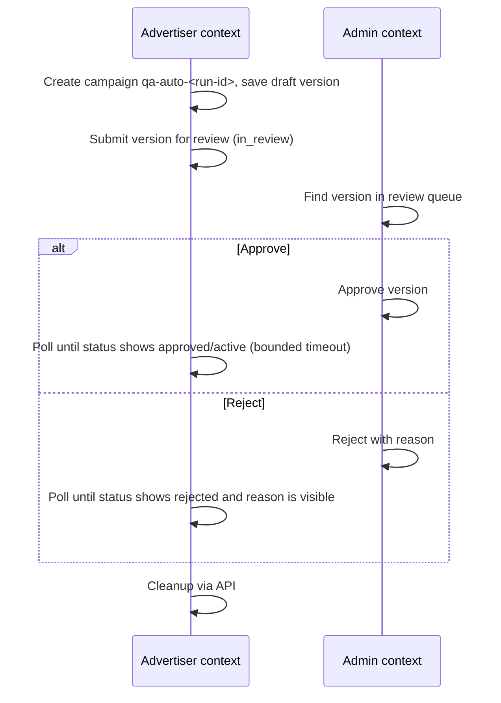

# QA-AUTO-11 — Cross-platform E2E: campaign review flow

| Field | Value |
| --- | --- |
| Type | Story |
| Size | M |
| Phase | 2 E2E |
| Depends on | QA-AUTO-08, QA-AUTO-10 |
| Blocks | — |
| Labels | `automation`, `e2e`, `cross-platform`, `regression` |

## Context

The `coad-qa-test-cases` skill names cross-platform propagation as a high-risk area: a change on one platform can be delayed, duplicated, reversed, or shown to the wrong role on another. Single-platform smoke suites (QA-AUTO-08, 10) do not catch this.

The campaign review flow crosses platforms: an Advertiser submits a version for review and a privileged reviewer decides it (assumed to be on Admin; confirm in QA-AUTO-10).

## Goal

Automate the campaign review flow end to end across platforms, including how fast and how correctly the status reaches each side.

## Scope

### In scope

- Happy path: submit → approve → status visible to the Advertiser.
- Reject path: submit → reject with reason → status and reason visible to the Advertiser.
- Publisher-side impact, only if the PO confirms one exists.

### Out of scope

- Delivery, billing, or reporting after approval (separate tickets once known).

## Flow

Status names after the decision are placeholders until the PO confirms them.

## Tasks

- [ ] Confirm the flow, status names, and any Publisher-side effect with the PO.
- [ ] Implement in `e2e/tests/cross-platform/` using two browser contexts with different `storageState` files (role-context fixture from QA-AUTO-07).
- [ ] Wait for propagation with `expect.poll` or `expect(...).toPass` and a configurable timeout; no fixed sleeps.
- [ ] Attach a screenshot from each context on failure.
- [ ] Tag `@regression`; run nightly only, not on pull requests.
- [ ] Clean up the campaign through the API, including after a failure.

## Acceptance criteria

- [ ] AC1 — Happy and reject paths are automated with TC IDs.
- [ ] AC2 — The propagation timeout is a config value; a timeout failure says which context waited for which status.
- [ ] AC3 — A failure report includes screenshots from both contexts.
- [ ] AC4 — The flow passes 3 consecutive nightly runs.
- [ ] AC5 — No `qa-auto-` campaigns remain after a run, including after a failed run.

## Deliverables

- `e2e/tests/cross-platform/campaign-review.spec.ts`
- Manual test cases for both paths (via the `coad-qa-test-cases` skill if missing).

## Open questions

- What is the expected propagation time from Admin decision to Advertiser view?
- Does the Publisher platform see anything when a campaign is approved?
- Are reviewer notifications (email or in-app) part of the flow to verify?

## References

- [QA-AUTO-08](QA-AUTO-08-advertiser-smoke-suite.md), [QA-AUTO-10](QA-AUTO-10-admin-smoke-suite.md)
- `.codex/skills/coad-qa-test-cases/SKILL.md` — cross-platform propagation risk.
