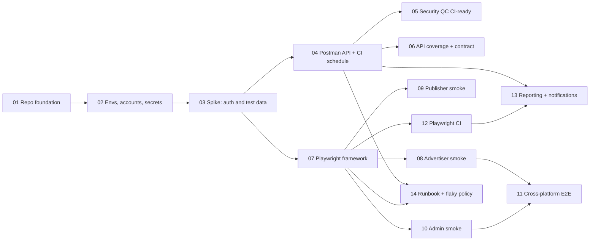

# Epic: COAD QA Automation

| Field | Value |
| --- | --- |
| Epic ID | QA-AUTO |
| Product | COAD — Advertiser, Publisher, Admin |
| Status | Draft — ready for grooming |
| Created | 2026-10-08 |
| CI platform | GitHub Actions (decided 2026-10-08) |
| Code location | This repository, under `postman/` and `e2e/` (decided 2026-10-08) |

## Goal

Move COAD regression from manual-only execution to automated API tests (Postman) and end-to-end UI tests (Playwright) that run on every relevant pull request and on a nightly schedule in GitHub Actions, across the three COAD platforms: Advertiser, Publisher, and Admin.

## Epic success criteria

- API and E2E regression run every night against COAD DEV with no manual step, and the team is notified of failures.
- A smoke subset runs on pull requests that change automation code and is a required check.
- Every automated test is traceable to a test case ID.
- No credential, session cookie, CSRF token, or API key is ever committed, logged, or uploaded as a CI artifact.

## Blocker: repository visibility

`maiphan1509/COOS-QC-tool` is **public** (checked 2026-10-08). Public repositories expose source, GitHub Actions logs, and workflow artifacts (HTML reports, Playwright traces, screenshots) to anyone.

Before any COAD environment file, account matrix, automation code, report, or the existing Security QC collection is pushed:

- make the repository private, or agree on a private repository for automation, and
- confirm workflow logs and artifacts are private.

Until then, keep these ticket files local too — they describe COAD environments and authorization test areas. Tracked as the first acceptance criterion of [QA-AUTO-01](QA-AUTO-01-repo-foundation.md).

## Ticket index

| ID | Title | Type | Size | Depends on | Phase |
| --- | --- | --- | --- | --- | --- |
| [QA-AUTO-01](QA-AUTO-01-repo-foundation.md) | Repository foundation for automation | Task | S | — | 0 Foundation |
| [QA-AUTO-02](QA-AUTO-02-environments-accounts-secrets.md) | Environments, test accounts, and secrets management | Task | M | 01 | 0 Foundation |
| [QA-AUTO-03](QA-AUTO-03-spike-auth-test-data.md) | Spike: authentication and test data strategy | Spike | M | 02 | 0 Foundation |
| [QA-AUTO-04](QA-AUTO-04-postman-api-ci-schedule.md) | Postman API automation with scheduled CI runs | Story | L | 03 | 1 API |
| [QA-AUTO-05](QA-AUTO-05-security-qc-collection-ci-ready.md) | Make the Security QC collection CI-ready | Story | M | 04 | 1 API |
| [QA-AUTO-06](QA-AUTO-06-api-coverage-contract-tests.md) | API coverage inventory and contract tests from `COAD.yaml` | Story | L | 04 | 1 API |
| [QA-AUTO-07](QA-AUTO-07-playwright-framework-3-projects.md) | Playwright framework with Advertiser, Publisher, Admin projects | Story | L | 03 | 2 E2E |
| [QA-AUTO-08](QA-AUTO-08-advertiser-smoke-suite.md) | Advertiser E2E smoke suite | Story | M | 07 | 2 E2E |
| [QA-AUTO-09](QA-AUTO-09-publisher-smoke-suite.md) | Publisher E2E smoke suite | Story | M | 07 | 2 E2E |
| [QA-AUTO-10](QA-AUTO-10-admin-smoke-suite.md) | Admin E2E smoke suite | Story | M | 07 | 2 E2E |
| [QA-AUTO-11](QA-AUTO-11-cross-platform-e2e.md) | Cross-platform E2E: campaign review flow | Story | M | 08, 10 | 2 E2E |
| [QA-AUTO-12](QA-AUTO-12-playwright-ci-pipeline.md) | Playwright CI pipeline | Story | M | 07 | 2 E2E |
| [QA-AUTO-13](QA-AUTO-13-reporting-notifications.md) | Test reporting and failure notifications | Task | M | 04, 12 | 3 Operate |
| [QA-AUTO-14](QA-AUTO-14-runbook-flaky-policy.md) | Runbook, flaky-test policy, and ownership | Task | S | 04, 07 | 3 Operate |

Sizes are initial estimates, to be refined at grooming: **S** ≈ 1–2 days, **M** ≈ 3–5 days, **L** ≈ 1–2 weeks.

## Dependency graph

## Suggested sequencing

- **Lane A — API:** 01 → 02 → 03 → 04 → 05 and 06 in parallel.
- **Lane B — E2E:** after 03: 07 → 08, 09, 10 in parallel → 11. Start 12 as soon as 07 is merged.
- **Lane C — Operate:** 13 and 14 once the first nightly runs of 04 and 12 are green.

With two engineers, split lanes A and B after 03 is closed.

## Definition of Done (every ticket)

- [ ] Work merged to `main` through a reviewed pull request that references the ticket ID.
- [ ] Runs green locally and in GitHub Actions against COAD DEV.
- [ ] Secret scan passes; no credential, cookie, token, or API key in code, logs, or artifacts.
- [ ] Conventions and runbook docs under `docs/automation/` updated for anything new.
- [ ] Every new automated test carries a test case ID in its name.
- [ ] New or changed tests pass 3 consecutive CI runs without a retry.
- [ ] Open questions in the ticket are answered or moved to a follow-up ticket.

## Shared conventions

- Ticket IDs `QA-AUTO-NN`; branch `qa-auto/NN-short-slug`; commit and PR titles start with the ticket ID.
- Test names: `<TC-ID> <Platform> - <Module> - <Behavior>`, matching the naming used by the `coad-qa-test-cases` skill.
- Tags: `@smoke`, `@regression`, `@security`, `@quarantine`.
- Entities created by automation are prefixed `qa-auto-<run-id>` so cleanup can find them.
- GitHub Environments: `coad-dev`, `coad-uat`.

## Epic-level open questions

1. Base URLs of Advertiser, Publisher, and Admin on DEV and UAT. Is UAT in scope?
2. Can GitHub-hosted runners reach COAD DEV, or is it behind VPN or an IP allowlist (self-hosted runner needed)?
3. Does login use 2FA, OTP, captcha, or lockout rules that block automation? Can DEV provide a test-only bypass?
4. Who provisions and owns automation accounts? May automation create organizations, groups, and campaigns?
5. Is there a seed or reset mechanism for DEV data? Does manual QA share the same DEV data?
6. Should app-repository pull requests or deployments trigger these suites (cross-repo `repository_dispatch`)?
7. Notification channel for failures: Slack, Microsoft Teams, or email?
8. Nightly schedule time and timezone. Tickets assume 01:00 ICT (UTC+7); confirm.
9. Postman plan and API-key owner: a service account, not a personal key.
10. Optional follow-up: capture a COAD platform reference (screens, routes, statuses), like the COOS one under `platforms/`, so tests and test cases cite observed behavior.

## Evidence used

- `.postman/resources.yaml` and `.postman/workflows.yaml` — Postman Native Git link to the team workspace.
- Postman workspace read on 2026-10-08: one collection (COAD Security QC), one environment (COAD DEV), one spec (`COAD.yaml`), zero monitors.
- `.codex/skills/coad-qa-test-cases/SKILL.md` — three COAD platforms and test naming.
- `.github/workflows/check.yml` — existing CI job that must keep passing.
