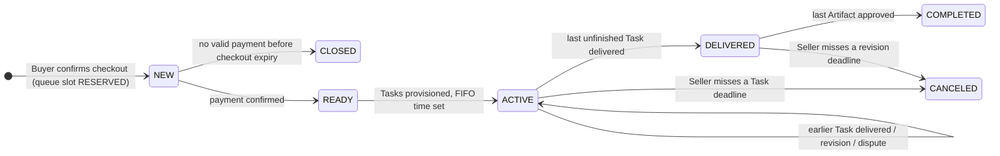
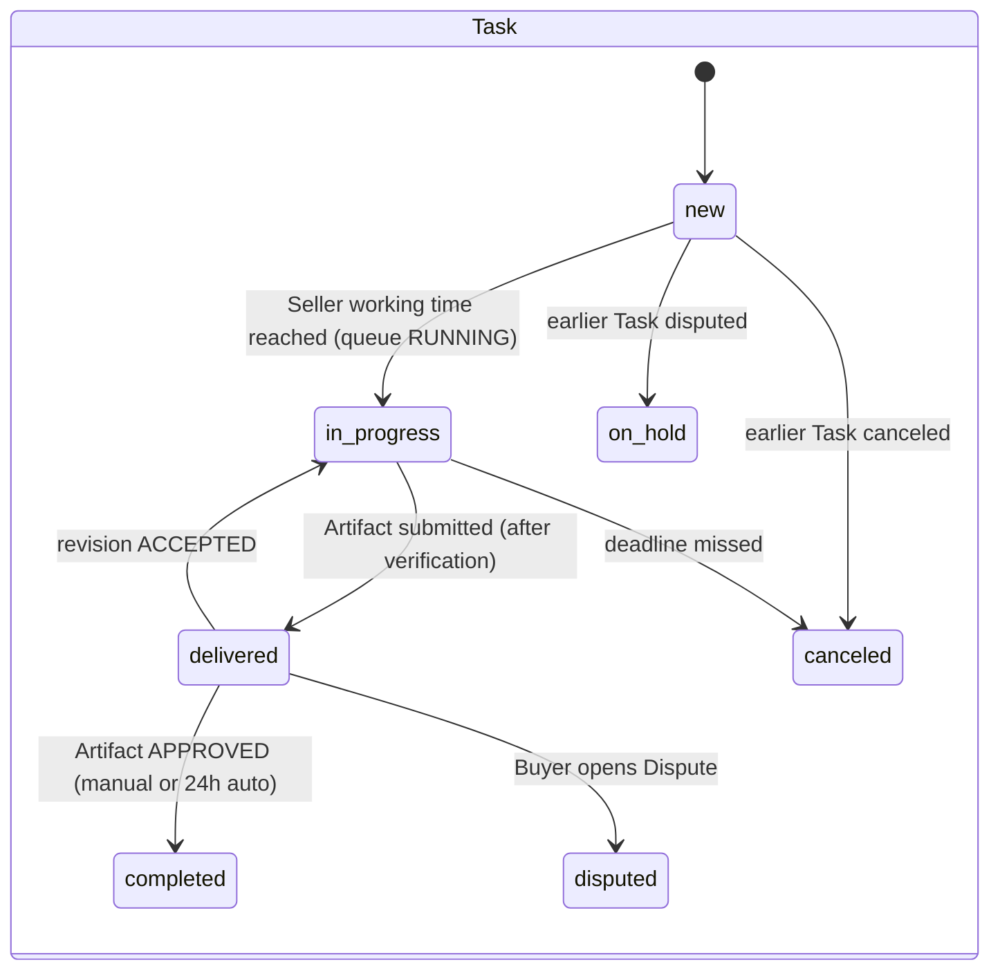
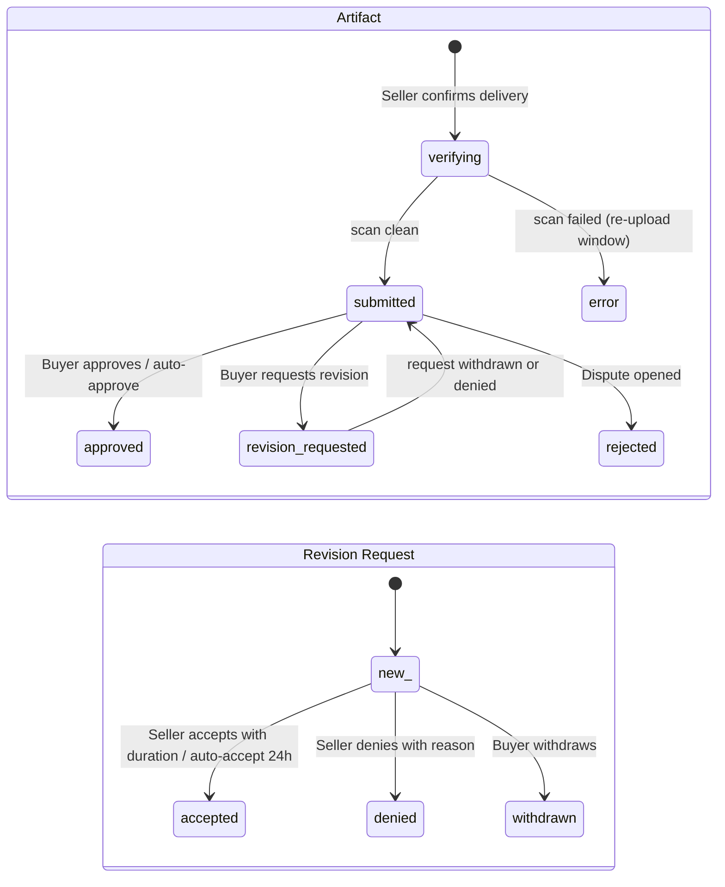

# COOS platform reference

Agent-facing knowledge base for the COOS marketplace (three portals sharing one Laravel application). Use it when a task touches COOS product documentation, QA test cases, or business diagrams and you need the real screens, routes, statuses, and configuration instead of guessing.

| Folder | Content |
| --- | --- |
| [`platforms/AGENTS.md`](AGENTS.md) (this file) | Platform map, shared foundations, glossary, status catalog, configuration values, route inventory, known defects |
| [`platforms/buyer/AGENTS.md`](buyer/AGENTS.md) | Buyer Portal `https://mynew1.net` — screens, features, all 67 `buyer.*` routes |
| [`platforms/seller/AGENTS.md`](seller/AGENTS.md) | Seller Portal `https://seller.mynew1.net` — screens, features, all 67 `seller.*` routes |
| [`platforms/admin/AGENTS.md`](admin/AGENTS.md) | Admin Portal `https://admin.mynew1.net` — screens, features, all 122 `admin.*` routes |
| [`platforms/workflows/AGENTS.md`](workflows/AGENTS.md) | Index of the four Mermaid workflow files (`.mmd`) and how each diagram step maps to portal screens and routes |

## How this reference was captured

- Snapshot date: 2026-09-10, staging environment `*.mynew1.net`, logged in as one Buyer, one Seller (display name "COOS 2"), and one Admin (role `super_admin`).
- Routing was read from the Ziggy route list embedded in the Seller and Admin Inertia pages (290 named routes; 260 application routes after removing `debugbar.*`, `horizon.*`, `storage.*`). Domains are part of the route definition, so the same list covers all three portals.
- Screens were read from rendered HTML, Inertia page props (`data-page`), Svelte island props (`data-svelte-props`), and JSON endpoints. No write action (POST/PUT/DELETE) was executed; write routes are documented from route names, form schemas, and button labels only.
- Everything here is observed behavior. Where a behavior could not be observed, the line starts with `Unresolved requirement:`. Do not invent a resolution; verify on the environment or ask.
- Staging data changes daily. Treat counts, codes, and example values as illustrative, never as fixtures.

## Platform map

| Portal | URL | Audience | Route prefix | Rendering | Entry after login |
| --- | --- | --- | --- | --- | --- |
| Buyer Portal | `https://mynew1.net` | Buyers browsing Fabs, checking out, reviewing deliveries | `buyer.` | Blade pages + Svelte islands (`data-svelte-props`), Vite bundle `/build/assets/app-*.js` | `/` (home) |
| Seller Portal | `https://seller.mynew1.net` | Sellers executing Orders, delivering Artifacts, answering revisions | `seller.` | Inertia.js + Svelte SPA, shadcn-style sidebar, brand "COOS · Seller Portal" | `/` (Dashboard) |
| Admin Portal | `https://admin.mynew1.net` | Platform operators (IAM, finance, operations, governance) | `admin.` | Inertia.js + Svelte SPA, brand "COOS · Admin Portal" | `/` (Dashboard) |

Observed technical facts (useful for automation, not for product specs): Laravel 12.64 / PHP 8.4, PostgreSQL, one code base with per-domain route groups (`Portal\Buyer`, `Portal\Seller`, `Portal\Admin` namespaces visible in audit rows), S3 bucket in `ap-southeast-1` with presigned URLs for uploads and downloads, Amazon GuardDuty malware scan on delivered files, Laravel Horizon queues, Laravel Debugbar and Boost browser-log endpoints present on staging.

## Shared foundations

### Accounts and authentication

- Each portal has its own user table and session (`BUY…`, `SEL…`, `ADM…` account codes). One person needs separate accounts per portal.
- Buyer and Seller: email + password registration, "Continue with Google" (`GET /{provider}/login`, callback `GET /auth/{provider}/redirect`), email verification (`/email/verify`, `/email/resend`), password reset (`/password/forgot`, `/password/email`, `/password/reset/{token}`), optional TOTP two-factor (`/accounts/2fa/qr-code`, `/accounts/2fa/qr-code/enable`, challenge at `/2fa/verify`).
- Admin: no self-registration (`/register` returns 404). Admins are invited from IAM > Invitations; the invitee sets a password at `GET|POST /password/create`. Login page reports `canRegister: false`.
- Buyer accounts carry `accepted_tos_at`; a Terms of Service modal island ("I have read and agree to the Terms of Service" / "Create my account") is embedded on Buyer pages for accounts that have not accepted.
- Logged-in users hitting `/login`, `/register`, `/join` are redirected to the portal home. Guests hitting protected pages are redirected to `/login`.
- Account self-service (all portals): profile (name, first/last name, phone, address, avatar), security (password update, resend verification, deactivate account, 2FA), appearance (language, region format, timezone; Seller/Admin also main and right sidebar behavior).

### Localization, currency, time

- Languages: English (`en`, always enabled), Vietnamese (`vi`), Thai (`th`). Admin can toggle `vi` and `th`.
- Region formats: `MM/DD/YYYY, HH:MM (12H)`, `DD/MM/YYYY, HH:MM (24H)`, `YYYY-MM-DD, HH:MM (24H)`.
- Currencies: USD (default) and VND. Buyer switches currency from the header island (`POST /set-currency`) and language via `POST /set-preference`.
- Timezone is stored per user (appearance settings) and per Seller working schedule. Delivery deadlines use Seller working hours; response timeouts use elapsed calendar hours (see workflows).

### Notifications

- Every portal exposes `GET /api/notifications` (paginated, `meta.total_unread_count`), `POST /api/notifications/mark-all-read`, `POST /api/notifications/{notification}/mark-read`.
- Notification item fields: `type`, `title`, `message`, `data.view_route`, `priority`, `is_read`, `is_archived`, `time_ago`, `formatted_time`, `formatted_date`.
- Types observed: `order.eta_updated` ("Order eta updated"), `order.completed`, `order_task.completed`, plus titles "Delivery verification started", "Delivery verified", "Delivery approved", "Execution released", "Task canceled", "Order canceled".
- Buyer header and mobile header render a bell island ("Notifications", empty state "No notifications yet.", action "Mark all as read").

### Audit and history

- Every business object exposes an Activities view (management audit rows: Code, Module, Created At, Created By, Action, Message) and a Status History view (Time, Old Status, New Status, Note, Changed By) in the Seller and Admin portals.
- Admin > Governance aggregates them: Activities (`/audit/activities`), Account Logs (`/audit/access-identity`, login/logout events with IP and auth method), Payment Logs (`/payment-logs`, gateway webhook log with signature validity).
- Audit modules observed: GENERAL, USER, ADMIN, SYSTEM, AUTH, TRANSLATION, AUDIT, INVITE, USER_GROUP, CATEGORY, MARKER, SELLER_PROFILE, SELLER_WORKING_SCHEDULE, ORDER, PAYMENT_INSTRUCTION (list truncated in the filter payload). Actions: create, update, delete, view, login, login_failed, logout.

### Files and delivery verification

- Uploads go through `POST /presigned-url` on each portal, then directly to S3. Download links are presigned and expire (observed 3600 s).
- A Seller delivery creates an Artifact in status `verifying`; the file is scanned (provider `amazon_guardduty`, result `NO_THREATS_FOUND` / "No threats found"). After verification the Artifact becomes `submitted`, `buyer_available_at` is set, and the Buyer review deadline starts. A failed scan yields status `error` and the Seller must re-upload within `order.artifact_error_reupload_timeout_hours`.
- Artifact upload form accepts one file (`maxFiles: 1`); configured maximum size `order.artifact_max_file_size_mb` = 200.

### Payments

- Gateways: PayPal (sandbox on staging), Airwallex (hosted page + polling), NowPayments (webhook route exists; not exposed in Admin settings). Webhooks: `POST /webhooks/paypal`, `POST /webhooks/airwallex`, `POST /webhooks/nowpayments` (no domain restriction).
- Objects: Payment Instruction (`PAY…`, one per payment attempt, statuses `new → processing → pending (Pending Settlement) → completed | failed | canceled`) and Transaction (`PTX…`, type `payment` or `refund`, statuses `pending | succeeded | failed`).
- Pricing snapshot per Order: `unit_price × package_quantity = subtotal`; `platform_fee = subtotal × platform_fee_percent`; `payment_fee = fixed_fee + subtotal × fee_percent` of the chosen gateway; `tax = subtotal × tax_percent`; `total_amount = subtotal + platform_fee + payment_fee + tax`. Example observed: 3 × 3000 = 9000, platform fee 225 (2.5%), PayPal fixed fee 0.3, tax 0, total 9225.30 USD.
- Checkout expiry: `order.checkout_expires_at` = created + `order.payment_checkout_expiry_minutes` (1440 min). Admin can force expiry (`POST /orders/{order}/expire-checkout`).

### Platform configuration (Admin > Configuration > General and Admin > Governance > Settings)

Values observed on 2026-09-10:

| Key | Label | Value |
| --- | --- | --- |
| `order.payment_checkout_expiry_minutes` | Payment Checkout Expiry (minutes) | 1440 |
| `order.buyer_artifact_review_timeout_hours` | Buyer Artifact Review Timeout (hours) | 24 |
| `order.seller_revision_response_timeout_hours` | Seller Revision Response Timeout (hours) | 24 |
| `order.buyer_revision_denial_response_timeout_hours` | Buyer Response After Denial Timeout (hours) | 24 |
| `order.minimum_revision_duration_hours` | Minimum Revision Duration (hours) | 1 |
| `order.auto_revision_duration_percent` | Auto Revision Duration Percent | 50 |
| `order.seller_max_execution_queue_orders` | Seller Max Execution Queue Orders | 8 |
| `order.artifact_error_reupload_timeout_hours` | Artifact Error Reupload Timeout (hours) | 24 |
| `order.artifact_max_file_size_mb` | Artifact Max File Size (MB) | 200 |
| `payment.platform_fee_percent` | COOS Platform Fee (%) | 2.5 |
| `payment.tax_percent` | Tax (%) | 0 |
| `payment.gateway.paypal.enabled` / `fixed_fee` / `fee_percent` | PayPal | enabled, 0.3, 0 |
| `payment.gateway.airwallex.enabled` / `fixed_fee` / `fee_percent` | Airwallex | enabled, 0, 0 |
| `locale.language.{en,vi,th}.enabled` | Localization | true, true, true |
| `currency_default`, USD active, VND active | Currency | USD, true, true |
| `company.*`, `app.*`, `email.*` | Platform Information, Admin Contact | empty on staging |

These values match the timing notes in the workflow diagrams (24 h review, 24 h Seller response, 24 h Buyer response after denial, 50% automatic revision duration with 1 h minimum).

## Glossary (COOS terms)

| Term | Meaning (observed) |
| --- | --- |
| Fab | A sellable service listing (`/fab/{fabSlug}`), owned by a Seller, placed in a Service Category item, with up to three Packages. Fab status observed: `published`. |
| Package | A tier of a Fab: `basic`, `standard`, `premium`. Has price, description, Package Items. |
| Package Item | A line in a Package: system items `Delivery Time` (`PID000000001`, hours), `Revisions` (`PID000000002`, count), `Number of Pages` (`PID000000003`), plus boolean features (for example "Functional website", "Source code"). |
| Brief | Free-text note the Buyer writes per Task at checkout ("Please describe your projects or items"). Required. |
| Order | One purchase of one Fab Package with quantity 1–3 (`ORD…`). Statuses below. Stores a full snapshot (fab, package, pricing, billing, briefs, working schedule). |
| Task | One unit of delivery per purchased quantity (`TSK…`, `sequence_no` 1..n). Tasks execute strictly in sequence. Fields: brief, delivery_duration_hours, revision_limit, accepted_revision_count, started_at, due_at, reupload_due_at. |
| Artifact | An official delivery of a Task (`ART…`, `sequence_no` per Task, `delivery_cycle_no`). Immutable history; a revision resubmission creates a new Artifact. |
| Revision Request | Buyer request to rework a submitted Artifact (`REV…`). One per Artifact. Statuses below. |
| Dispute | Buyer escalation on a Task (`DSP…`). Opening it rejects the current Artifact, marks the Task `disputed`, holds later Tasks, blocks the Seller queue slot. Resolution is out of scope (status `open` only). |
| Seller Execution Queue | Per-Seller FIFO of paid Orders (`SEQ…`). One `running` entry per Seller; others `waiting`; `blocked` when a Dispute is open; `released` on completion/cancel. Admission threshold `order.seller_max_execution_queue_orders`. |
| Working schedule | Seller's weekly availability (per weekday enabled/start/end + timezone). Snapshotted into Orders and Tasks; used to compute delivery deadlines and projected dates. |
| Payment Instruction | A payment attempt for an Order with a gateway (`PAY…`). |
| Transaction | Gateway money movement linked to a Payment Instruction (`PTX…`). |
| Service Category | Buyer menu hierarchy: L1 category (`CL1…`, `max_depth` 3, pinned menu/filter flags) with nested category items (L2/L3). |
| Marker | Display badge or icon attached to categories/items (`MRK…`), e.g. Featured, Popular, New, Trending, Recommended. |
| Reason catalogs | Revision reasons (`RRT…`): Missing requirements, Quality not as expected, Bug or issue found, Incomplete delivery, Wrong files submitted, Needs adjustment based on brief, Other. Deny reasons (`DRV…`): Out of scope, Already addressed, Unreasonable request, Insufficient information, Exceeds revision scope, Other. |

## Status catalog

| Object | Statuses (label → badge variant) |
| --- | --- |
| Order | `new` New (warning) · `ready` Ready (secondary) · `active` Active (info) · `delivered` Delivered (primary) · `completed` Completed (success) · `closed` Closed (danger) · `canceled` Canceled (danger) |
| Task | `new` · `in_progress` In Progress · `delivered` · `completed` · `disputed` (danger) · `on_hold` On Hold (warning) · `canceled` |
| Artifact | `verifying` (warning) · `submitted` (info) · `revision_requested` Revision Requested (warning) · `approved` (success) · `rejected` (danger) · `error` (danger). `approval_type`: `manual` or automatic. |
| Revision Request | `new` (info) · `accepted` (success) · `denied` (danger) · `withdrawn` (warning) |
| Dispute | `open` (danger) |
| Seller Execution Queue | `reserved` (secondary) · `waiting` (warning) · `running` (info) · `blocked` (danger) · `released` (success) |
| Payment Instruction | `new` · `processing` (warning) · `pending` "Pending Settlement" (info) · `completed` (success) · `failed` (danger) · `canceled` |
| Transaction | type `payment` / `refund`; status `pending` / `succeeded` / `failed` |
| Payment Log | `processing_status`: `processed` / `failed` / `ignored`; `signature_valid` Yes/No |
| Account | `active` / `inactive`; `platform` admin/seller/buyer; 2FA Enabled/Disabled |
| Invitation | `pending` · `accepted` · `revoked` · `expired` · `rejected` |
| Service Category / Marker | `is_active` Active/Inactive; category `is_pinned_menu`, `is_pinned_filter`; marker `type` badge/icon |

### Lifecycle summary

Full diagrams with policies and timing notes: [`workflows/`](workflows/AGENTS.md).

## Route inventory

260 application routes, grouped by domain. Per-portal tables (name, method, URI, screen, observed status) live in the portal files.

| Group | Count | File |
| --- | --- | --- |
| Global (no domain) | 4 | below |
| `admin.*` @ `admin.mynew1.net` | 122 | [admin/AGENTS.md](admin/AGENTS.md#routes) |
| `buyer.*` @ `mynew1.net` | 67 | [buyer/AGENTS.md](buyer/AGENTS.md#routes) |
| `seller.*` @ `seller.mynew1.net` | 67 | [seller/AGENTS.md](seller/AGENTS.md#routes) |

Global routes:

| Route name | Method | URI | Purpose |
| --- | --- | --- | --- |
| `boost.browser-logs` | POST | `/_boost/browser-logs` | Laravel Boost browser log sink (dev tooling) |
| `webhooks.paypal` | POST | `/webhooks/paypal` | PayPal webhook; rows appear in Admin > Payment Logs |
| `webhooks.airwallex` | POST | `/webhooks/airwallex` | Airwallex webhook (`payment_attempt.paid` events observed) |
| `webhooks.nowpayments` | POST | `/webhooks/nowpayments` | NowPayments webhook |

Framework routes present but out of scope: `debugbar.*` (`/_debugbar/...`), `horizon.*`, `storage.local`.

### URL patterns shared by Seller and Admin

- List pages are Inertia `default/datatable`: toolbar search (help text "Code — enter one or more values, separated by commas" or "All — enter one value to search across …"), filter panel, column-visibility settings (`default_visible_columns`), pagination `per_page` ∈ {5, 10, 15, 25, 100} (default 15), default sort `created_at desc`, badge columns from a status map, code columns link to the show page. Query parameters: `page`, `per_page`, `search`, `search_field`, `sort_by`, `sort_order`, `filters[...]`.
- Detail pages are Inertia `default/form-builder` in read-only mode with a right sidebar "Views" section (Overview, Activities, Status History, plus object-specific tabs) and, when applicable, an "Actions" section with confirmation dialogs.
- Every detail sub-view (`/activities`, `/status-history`, `/tasks`, `/artifacts`, `/revision-requests`, `/disputes`) is a datatable filtered to the parent object and carries a "brief" header (code, status) of the parent.

## Known defects observed on staging (2026-09-10)

Report these as environment findings; do not document them as intended behavior.

| Portal | Request | Observed |
| --- | --- | --- |
| Buyer | `GET /orders`, `GET /orders/{order}`, `GET /orders/{order}/revisions`, `GET /accounts/security` | HTTP 500 `InvalidArgumentException: Unsupported tenant type: buyer` (sidebar provider resolves only seller/admin) |
| Buyer | `GET /email/verify` → redirects to `GET /email/resend` | HTTP 500 `View [buyer.auth.email-form] not found` |
| Buyer | `GET /category-fabs` without `level`, `id`, `page` | HTTP 404 (loader requires the parameters the "Show more" button sends) |
| Seller | `GET /join` | HTTP 500 `Method SellerAuthController::join does not exist` |
| Admin | `GET /category-items` (target of sidebar row action "View Items") | HTTP 404 |
| Admin | `GET /category-items/create` | HTTP 500 |
| Admin | `GET /password/create` without invitation token | HTTP 404 |
| Admin | `GET /api/notifications` as guest | HTTP 500 `Trying to access array offset on null` (should be 401) |
| All | Any 500 | Full stack trace with source paths is rendered (debug mode enabled on staging) |
| Admin | Sidebar items Conversations > Chat Threads, Operation > Service Models, Operation > Add-ons Models | `href="#"` placeholders, no screen |

## Updating this reference

- Re-capture, do not hand-edit numbers: routes come from the Ziggy list in `data-page`, table columns and filters from `props.tableData`, forms from `props.formSchema`, Buyer islands from `data-svelte-props`.
- Keep `Unresolved requirement:` lines until the behavior is observed; then replace them with the observed behavior and the date.
- Never paste personal data (buyer names, emails, IPs), CSRF tokens, presigned URLs, or provider references into these files. Seller display names of test accounts ("COOS", "COOS 2") are acceptable.
- When a workflow diagram changes, update the mapping table in `workflows/AGENTS.md` in the same change.
